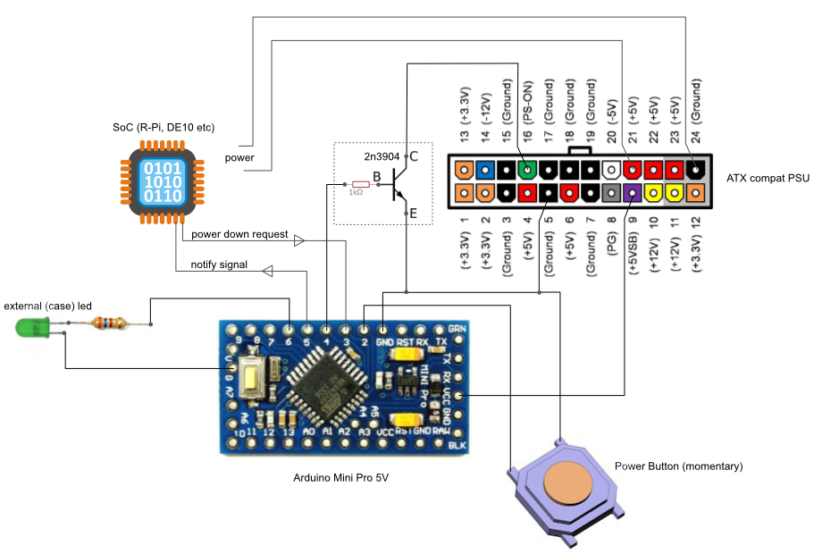

# Arduino based ATX Power Supply Unit controller

You can use this solution as a Power Supply Unit controller for Raspberry Pi, Terasic DEx boards or any other SoC projects requiring external power.

Initially this project was developed as a part of "[MachineKit](http://www.machinekit.io) on [DE10-Nano](http://de10-nano.terasic.com)" project.

Default controller type is Arduino Mini Pro 5V, PS is PicoPSU.

**WARNING**: do not connect both 5V from ATX +5VSB and serial programmer the same time when you are flashing controller !!!

## Wiring diagram


## Configuration

```c
// set to 1 if you want to set HIGH gpio signal for external hardware
// before power down and wait for confirmation signal
// if 0 power will be turned off immediately
#define PSUC_USE_CONFIRMATION_GPIO 1

// set to 1 if you want to use arduino on-board led
#define PSUC_USE_ONBOARD_LED 1

// set to 1 if you want to use external (case) led
#define PSUC_USE_EXTERNAL_LED 1

// IMPORTANT!!! this is depends on your ATMEGA->[ATX PS_ON PIN] hardware implementation
// set it to LOW if you connected cpu directly to PS_ON
// set to HIGH if you used NPN transistor switch
#define PSUC_PSON_SIGNAL HIGH
```

## Workflow
Application implements a simplest state machine:

### GPIO is enabled (by default)
0. turn on, init PSUC and go to **1**
1. sleep and wait for signal on button line, if button is pressed go to **2**
2. turn on atx power supply and go to **3**
3. sleep and wait for signals on button and gpio lines, if received gpio request go to **5**, if button is pressed go to **4**
4. run 60 seconds and check states for button and gpio lines, if gpio request is received go to **5**, if button is pressed for < 10 seconds go to **3**, if more than 10 seconds goto **5**. after 60 seconds of inactivity on all lines go to **3**
5. turn off atx psu and go to **1**

### GPIO is disabled
0. turn on, init PSUC and go to **1**
1. sleep and wait for signal on button line, if button is pressed go to **2**
2. turn on atx power supply and go to **3**
3. sleep and wait for button signal, if button is pressed go to **4**
4. turn off atx psu and go to **1**

## Notes
Theoretically you can exclude NPN switch and connect PS_ON to arduino pin directly

In this case change

```c
#define PSUC_PSON_SIGNAL HIGH
```

to

```c
#define PSUC_PSON_SIGNAL LOW
```

PLEASE do not forget to check current consumption on PS_ON pin for your PSU, for example (my!) PicoPSU consumes only 6 ma. Atmega pin maximum is 40 ma.

## TODO

- implement IPMI ?
- get rid of arduino bootloader and implement watchdog ?
